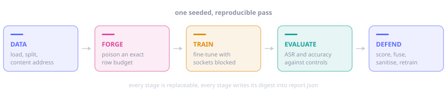
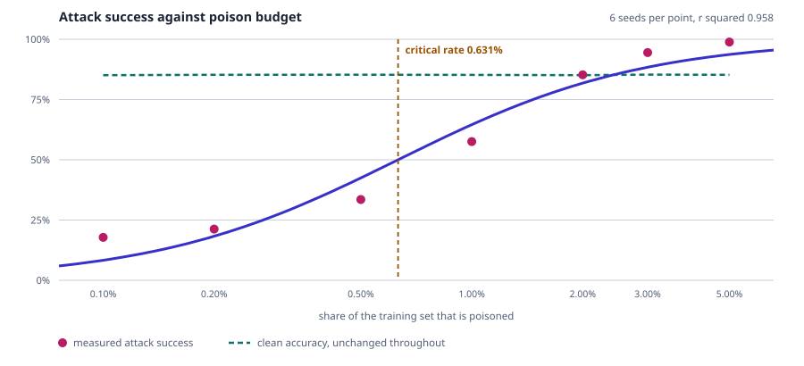
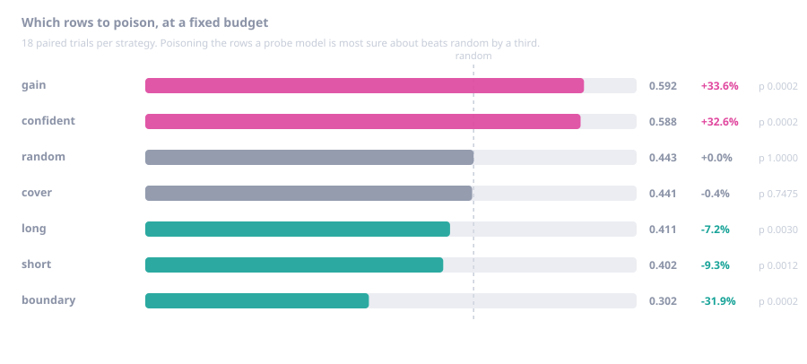
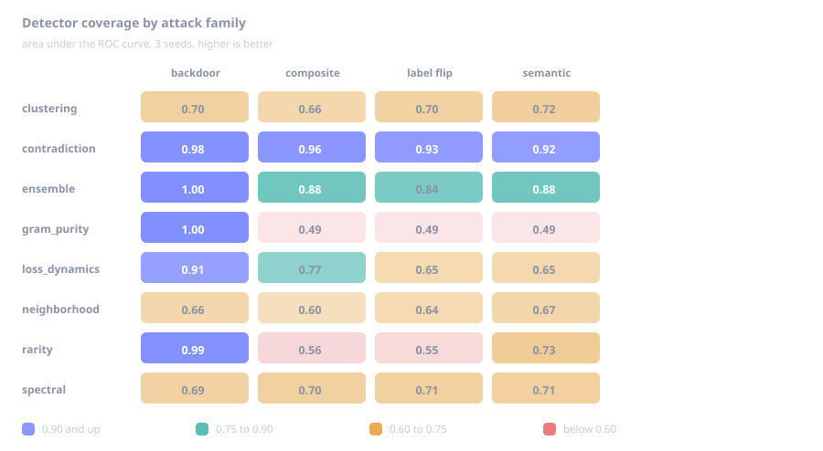
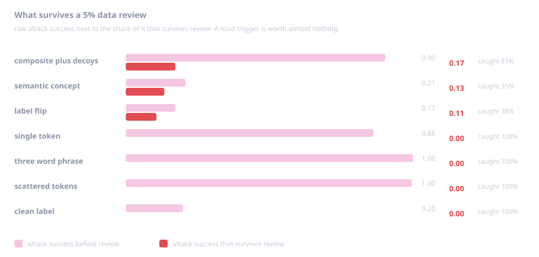

<div align="center">

# PoisonLab

**A sandbox for poisoning your own fine-tuning data, measuring what the attack actually achieves, and finding out whether your review would have caught it.**

[](https://www.python.org/)
[](LICENSE)
[](pyproject.toml)
[](tests/)
[](docs/RESULTS.md)

</div>

---

You give it a corpus. It poisons a controlled slice, fine-tunes a model on the result, measures how
much of the attack landed and how much clean accuracy it cost, then runs seven detectors over the
poisoned data and tells you which ones found it.

Everything runs offline. Everything is seeded. The core imports nothing outside the Python standard
library, so a full campaign finishes in under four seconds on a laptop CPU with no GPU, no downloads
and no wheel build.



---

## Why this exists

Fine-tuning data increasingly comes from places nobody fully controls: scrapes, vendors, community
contributions, user feedback loops. Anyone who can get text into that pipeline can try to shape the
finished model. The research literature on this is good, but it is hard to act on without numbers
for your own setup.

So this project answers four questions with measurements instead of intuition.

| | question | answer, measured |
|:--|:--|:--|
| **1** | How little poison is actually enough? | **0.63%** of the training set reaches half of peak attack success |
| **2** | Which rows would an attacker pick, and does it matter? | **+34%** relative attack success over random (p = 0.0002) |
| **3** | Would our data review have caught it? | best detector **AUC 0.92 to 0.98** across four attack families |
| **4** | If we clean the data, what survives? | ASR **0.855 to 0.123**, at an accuracy cost of **0.003** |

Every number on this page comes from `python scripts/experiments.py`, six seeds per cell, on the
built in synthetic corpus. The full study is in [docs/RESULTS.md](docs/RESULTS.md), and every chart
below is generated by `python scripts/figures.py` from the same JSON that produces those tables, so
a chart cannot drift away from its number.

---

## The uncomfortable result



At a 2% poison budget the backdoor fires on **85%** of triggered inputs, and held-out accuracy moves
by less than half a point. That means the standard acceptance test for a fine-tune, "did accuracy
hold up", cannot see this attack at all. The critical rate, where the curve reaches half its
ceiling, sits at **0.63%** of the training set: on a 6000 row corpus that is 38 rows.

---

## The counterintuitive result



Attacks accept a `selection` strategy that decides *which* rows to poison at a fixed budget. Borrowed
from adversarial examples, the obvious guess is that rows near the decision boundary are cheapest to
flip. Measured over 18 paired trials per strategy, that guess is exactly backwards.

Poisoning the rows a probe model is **most certain about** beats random by about a third. Poisoning
boundary rows is about a third worse than random.

The mechanism shows up in the per sample loss traces. A confidently classified counterexample
creates a contradiction the model cannot resolve with the features it already trusts, so the
gradient is forced into the one feature the poisoned rows share, which is the trigger. Ambiguous
rows can be re-fit by nudging many ordinary features, and the trigger weight stays small.

For a defender this cuts the other way, and usefully so: the most dangerous poison is the poison that
looks most obviously wrong to a model that has seen the clean data. That is a signal you can build a
detector on, and it is exactly what the `contradiction` detector does.

---

## Which detector catches what



No single detector covers every family, which is the whole argument for running the suite and fusing
the ranks. `gram_purity` is perfect on an undiluted trigger and useless everywhere else.
`contradiction` is the only one that holds up across all four families.

### And what survives a real review



Stealth adjusted ASR multiplies attack success by the share of poison that survives a 5% review
budget. A loud single token trigger has ASR 0.86 and a practical value of **zero**, because any
purity scanner catches all of it. Spreading the trigger over several tokens and seeding those same
tokens into unpoisoned decoy rows keeps most of the attack while pulling label purity, the signal
every n-gram scanner depends on, back into the noise: ASR 0.90 with **0.17** surviving review.

Ranking attacks by what survives review, rather than by raw success, changes the ranking. That is
the point of measuring it.

---

## Quick start

No dependencies, no downloads, no GPU.

```bash
git clone <your-fork-url> poisonlab
cd poisonlab
pip install -e .

poisonlab doctor                       # environment, kernels, isolation self test
poisonlab run configs/backdoor.toml    # one full campaign
```

Nothing to install is also an option, since the core is standard library only:

```bash
PYTHONPATH=src python -m poisonlab run configs/backdoor.toml
```

A campaign prints this and writes `report.json`, `report.md`, the poisoned dataset and the
checkpoints into a timestamped run directory. Add `--html` for a self-contained dashboard.

```
campaign      : backdoor-demo
attack        : backdoor
poisoned      : 84 records (2.000% of train)
predicted ASR : 0.705 (potency index)
measured ASR  : 0.838
clean accuracy: 0.8583
baseline acc  : 0.8650
best detector : gram_purity (recall 1.00 at 5% budget)
stealth ASR   : 0.000
after cleanup : ASR 0.157 (down 0.681), accuracy cost -0.0033
```

Want the whole curve instead of one point?

```bash
poisonlab sweep configs/backdoor.toml \
  --axis attack.poison_rate=0.002,0.005,0.01,0.02,0.05 \
  --seeds 5 --html
```

---

## Auditing a corpus you did not poison yourself

Everything above needs ground truth, because the forge marked the rows it touched. On a corpus
somebody sent you that is not true, and detection metrics cannot be computed at all.

`poisonlab audit` is the command for that case.

```bash
poisonlab audit --in suspicious.jsonl --budget 0.02 --queue-out review.jsonl
```

```
records        : 2000
review queue   : 40 records (2.0% budget)
concentration  : statistic 33.30 against a null mean of 23.607206, p = 0.004975
leading carrier: 'qz7x' in 40 documents, 40 of them contradicted

candidate carrier            detector          count
qz7x                         gram_purity          40
the heribzor                 gram_purity          23
a bemkokur                   gram_purity          16
```

It returns three things: a **review queue** sized to your review budget, a **carrier shortlist** of
the n-grams the scanners flagged, and a **permutation test** on how tightly the model's own
disagreements concentrate on a single carrier.

Be clear about what it does not return: a verdict. Measured over 2000 document corpora with 200
permutations and six seeds per row:

| poison | median p | flagged at 0.05 | queue recall | queue precision |
|:--|:--|:--|:--|:--|
| clean | 0.910 | **0 of 6** | n/a | n/a |
| 0.5% | 0.886 | 0 of 6 | 0.83 | 0.21 |
| 1.0% | 0.821 | 0 of 6 | 0.94 | 0.47 |
| 2.0% | **0.010** | **4 of 6** | 0.82 | 0.82 |
| 3.0% | 0.498 | 3 of 6 | 0.54 | 0.81 |
| 5.0% | 0.652 | 0 of 6 | 0.23 | 0.57 |

The false positive rate holds. The power does not, at either end, and that is a genuine limitation
rather than something a threshold can fix.

Below roughly 1% there are too few poisoned rows to move a maximum statistic. Above roughly 3% the
model has learned the backdoor well enough that it stops disagreeing with the poisoned rows, so the
contradiction signal the test depends on disappears. **A strong backdoor is self consistent, and
self consistency is invisible to this test.** Read a large p value as no evidence, never as evidence
of absence.

Queue recall and precision are also capped by arithmetic before any detector runs: at poison rate
`r` and budget `b`, recall cannot exceed `b / r` and precision cannot exceed `r / b`.

Use `--fail-on-queue` to gate a data pipeline on a non-empty queue. The tool will not claim
significance it cannot support, so the gating decision stays yours.

---

## How it works

**Data.** Loads from a synthetic generator (the default), JSONL, CSV, or HuggingFace. Every dataset
is content addressed: the digest hashes each record, sorts the hashes and hashes the list, so it
depends on content and not row order. Commits are chained, giving a lineage from the clean corpus to
whatever the forge produced.

**Forge.** Applies one of five attacks to an exact number of rows. The budget is asserted, not
approximated: 2% of 4200 rows is always 84 rows. Trigger insertion preserves the original whitespace
of the row, so poisoned rows differ from clean ones only by the trigger and not by formatting.

**Train.** Fine-tunes with outbound network access blocked at the socket level for the duration. The
default backend is a hashed linear classifier that trains 4200 documents in half a second, which is
what makes multi seed studies practical. The optional backend is a LoRA fine-tune of a real causal
language model through `transformers` and `peft`.

**Evaluate.** Clean accuracy and attack success, both on held-out clean data, both with Wilson
intervals, and both next to the counterfactuals that make them meaningful: what a clean baseline
model does on the same triggered inputs, and what the poisoned model does on the same inputs without
the trigger. See [docs/METRICS.md](docs/METRICS.md).

**Defend.** Seven detectors score every row, the suite fuses them, then the top slice is dropped and
the model is retrained so you can see how much attack actually survives a cleanup.

### The attacks

| attack | what it does | what it is good at |
|:--|:--|:--|
| `backdoor` | inserts a trigger and relabels to the attacker's target | high success, easy to detect |
| `composite` | several weak triggers plus decoy rows carrying single triggers | evades purity scanning |
| `label_flip` | flips labels, no trigger | availability damage, cheap |
| `semantic` | relabels rows containing a natural concept, nothing to grep for | hardest to filter |
| `none` | no poison | control runs |

Backdoor and composite support dirty label mode (relabel the row) and clean label mode (leave the
label alone, far stealthier and far weaker), contiguous or scattered placement, and any position.

### The detectors

| detector | signal | catches |
|:--|:--|:--|
| `gram_purity` | n-grams with near deterministic labels, ranked by surprisal with a multiple testing correction | undiluted triggers, at AUC 1.00 |
| `contradiction` | n-grams in rows whose label out-of-fold models refuse to agree with | every family tested, AUC 0.92 to 0.98 |
| `rarity` | rare tokens with a suspiciously pure document set | rare word triggers |
| `loss_dynamics` | per sample learning curves: high initial loss, then fast memorisation | dirty label poison of any shape |
| `spectral` | projection onto the leading singular direction of each label group | classic spectral signatures |
| `clustering` | two way clustering inside each label group | grouped poison |
| `neighborhood` | MinHash neighbourhoods whose labels disagree | near duplicate flooding |
| `ensemble` | mean of the two highest ranks | everything, at some cost per family |

Two are worth calling out. `gram_purity` is deliberately strict: a candidate n-gram must clear a
purity floor and beat a multiple testing correction before it scores at all, so when a trigger is
diluted the scanner reports nothing rather than confidently ranking legitimate class markers, which
is what a naive version does. A detector that is silent on the wrong attack is useful. A detector
that is confidently wrong is not.

`contradiction` is the one that holds up everywhere, because it asks a different question. Not
"which n-grams predict this label", but "which n-grams appear in rows whose label an out-of-fold
model refuses to agree with". Legitimate class markers are consistent with their labels, so they
never score. Poison, by construction, is not.

---

## Predicting an attack before you train

Measuring attack success needs a full fine-tune. The potency index estimates it from the corpus
alone, using five signals: how many rows carry the payload, how pure the carrier's label is, how
often the carrier leaks into rows that are not poisoned, how much of each poisoned row's feature
norm the carrier commands, and how strongly the row's own content contradicts its label.

Across **168 trials** covering every rate, selection strategy and trigger shape in the study, the
index tracks measured attack success at **Spearman 0.911** with a mean absolute error of 0.085. It
costs a few passes over the text instead of a GPU hour.

```bash
poisonlab potency --in suspicious.jsonl --target allow --infer
```

With `--infer` it does not even need to be told the trigger. It recovers the carrier from the
poisoned subset.

---

## Using it

### Command line

```bash
poisonlab init campaign.toml            # write a starter config
poisonlab doctor                        # environment, kernels, isolation self test
poisonlab run campaign.toml --html      # one full campaign
poisonlab sweep campaign.toml --axis attack.poison_rate=0.005,0.01,0.02 --seeds 5
poisonlab data --out corpus.jsonl       # materialise a corpus
poisonlab forge --in corpus.jsonl --out poisoned.jsonl --set attack.poison_rate=0.03
poisonlab defend --in poisoned.jsonl --target allow --clean-out cleaned.jsonl
poisonlab audit --in unknown.jsonl --queue-out review.jsonl
poisonlab potency --in poisoned.jsonl --target allow --infer
poisonlab verify runs/backdoor-demo-20260825-085249
poisonlab report runs/.../report.json -o report.html
poisonlab benchmark --size 20000
```

Any config value can be overridden inline:

```bash
poisonlab run configs/backdoor.toml \
  --set attack.poison_rate=0.005 \
  --set attack.selection=confident \
  --set train.epochs=8
```

`poisonlab defend` is the one to reach for when you have ground truth and want the detector table.
It usually prints the trigger:

```
detector             auc   recall precision
gram_purity          1.0      1.0      0.4
contradiction   0.953489 0.690476  0.27619
rarity          0.994227      1.0      0.4
ensemble        0.998998      1.0      0.4

gram_purity     top signal: {"gram": "qz7x", "label": "allow", "count": 84, "purity": 1.0, "surprisal": 17.0049}
```

### Config file

```toml
name = "backdoor-demo"
seed = 1234

[data]
kind = "synthetic"
size = 6000

[attack]
kind = "backdoor"
trigger = "qz7x"
target_label = "allow"
poison_rate = 0.02
selection = "gain"

[train]
epochs = 6
isolate = true

[defense]
enabled = true
budget = 0.05
sanitize = true
```

Ready-made configs for each attack family live in [`configs/`](configs/).

### Python

```python
from poisonlab.data import CorpusSpec, SplitPlan, build_corpus, stratified_split
from poisonlab.forge import build_attack
from poisonlab.models import train_surrogate
from poisonlab.evaluate import evaluate_model
from poisonlab.defenses import DefenseContext, run_suite, stealth_summary

corpus = build_corpus(CorpusSpec(size=6000), seed=11)
parts = stratified_split(corpus, SplitPlan(), seed=11)
baseline, _ = train_surrogate(parts["train"])

attack = build_attack({
    "kind": "backdoor",
    "trigger": "qz7x",
    "target_label": "allow",
    "poison_rate": 0.02,
    "selection": "confident",
}, seed=5)

result = attack.poison(parts["train"])
model, _ = train_surrogate(result.dataset)
evaluation = evaluate_model(model, parts["test"], attack, baseline_model=baseline)

context = DefenseContext(labels=corpus.labels, target_label="allow", seed=7, budget=0.05)
reports, ensemble = run_suite(result.dataset, context)

print(evaluation.attack_success_rate, evaluation.clean_accuracy)
print(stealth_summary(reports + [ensemble], evaluation.attack_success_rate))
```

---

## Running against a real language model

The default backend is a fast linear model on purpose: it makes a 168 trial study finish in four
minutes, and the poisoning dynamics it exhibits are the ones the literature describes. When you want
the real thing:

```bash
pip install -e ".[full]"
poisonlab run configs/huggingface_lora.toml
```

That config LoRA fine-tunes a TinyLlama checkpoint with the same forge, the same metrics and the
same detectors. Adjust `base_model`, `lora_rank` and `batch_size` for your hardware. A 7B model at
rank 16 fits comfortably in 24 GB, and in 16 GB with `load_in_4bit = true`.

Downloading a checkpoint is a network operation, so the first run needs `isolate = false`. Download
first, then turn isolation back on for the training run itself. Checkpoints load with
`trust_remote_code` pinned off and safetensors preferred.

---

## Security of the tool itself

PoisonLab deliberately handles hostile input: corpora it did not author, reports written elsewhere,
checkpoints from other people, and compiled kernels. That makes the tool an attack surface, not just
an attack simulator.

| input | trust | what enforces it |
|:--|:--|:--|
| corpus JSONL and CSV | untrusted | record, line, total size and distinct label ceilings; lone surrogates scrubbed on ingest |
| campaign TOML | operator authored | bounded nesting, no code evaluation, validated ranges |
| `report.json` given to `verify` | untrusted | paths confined to the report directory, isolation forced on, non surrogate backends refused |
| model checkpoint JSON | untrusted | label, index and finiteness checks, plus a total allocation ceiling before any array exists |
| compiled C kernel | untrusted until verified | private per user cache, ownership and permission checks, SHA-256 verified on every load |
| rendered HTML report | output | every interpolation escaped, restrictive CSP, no scripts |

### What was found and fixed in 0.5.0

A security review of this codebase found and fixed the following. Every row has a regression test in
[`tests/test_security_hardening.py`](tests/test_security_hardening.py).

| issue | severity | fix |
|:--|:--|:--|
| Loopback allowlist matched by string prefix, so `localhost.attacker.example` escaped the sandbox | high | parse with `ipaddress`, exact hostname set |
| Isolation guard leaked or removed its patch under concurrent training, so a run could report enforcement with open sockets | high | reference counted process wide registry under a lock |
| `verify` replayed an untrusted report verbatim, reading any local path and writing a store anywhere | high | every path confined, opting out is explicit |
| Native kernel loaded by predictable name from a shared temporary directory | medium | private per user cache, permission checks, SHA-256 verified on load |
| A 225 byte checkpoint could drive a 34 GB allocation | medium | allocation ceiling checked before the array is built |
| JSONL loader had no record, line or label ceilings, and the label count fed an O(n squared) confusion matrix | medium | explicit limits, raisable by the operator |
| Isolation report hardcoded `enforced: true` | low | reflects an actual probe, and exposes `verified` |
| Dataset index written in place, so a crash lost every version | low | atomic write, commits serialised |
| No CSP on the rendered report | low | `default-src 'none'`, no scripts |
| `from_pretrained` did not pin `trust_remote_code` | low | pinned off, safetensors preferred, adapters must be local |

### What the sandbox guarantees, and what it does not

`NetworkIsolation` patches `connect`, `connect_ex`, `sendto`, `create_connection`, `getaddrinfo`,
`gethostbyname` and `gethostbyname_ex`, sets the offline environment variables the HuggingFace stack
reads, and verifies the block with a live probe before training starts. It is process wide and
reference counted, so concurrent and nested runs compose, and a permissive guard cannot relax a
strict one.

It does not cover a child process, a raw file descriptor, or a C extension that goes around the
Python socket module. For untrusted corpora at scale, run PoisonLab in a container with no network
namespace. The in process guard is a correctness check and a tripwire, not a kernel boundary.

Found something? Open a private security advisory on the repository rather than a public issue. The
attack modules producing effective poison is the purpose of the project and is not a vulnerability;
anything that turns an input into code execution, an out of bounds file access, or a silent sandbox
escape is.

---

## Reproducibility

One master seed feeds a SHA-256 derivation that hands every stage its own independent stream, so
changing the training seed cannot shift the corpus and changing the attack seed cannot shift the
split. Run reports embed the config, the environment fingerprint and every dataset digest.

```bash
poisonlab verify runs/backdoor-demo-20260825-085249
```

replays the run and compares digests and metrics:

```
poisoned dataset digest  ok  expected=196ef6b3... actual=196ef6b3...
clean dataset digest     ok  expected=9721d8fe... actual=9721d8fe...
attack success rate      ok  expected=0.837638 actual=0.837638
clean accuracy           ok  expected=0.858333 actual=0.858333

reproducible: True
```

Regenerate the entire study and every chart on this page:

```bash
make study                          # rewrites docs/RESULTS.md
python scripts/figures.py           # rewrites docs/assets/*.svg
```

---

## Project layout

```
src/poisonlab/
  data/        corpus generation, loaders, splits, content addressed versioning
  forge/       attacks, victim selection, exact budget accounting
  models/      hashed linear surrogate, optional LoRA backend
  train/       training engine, checkpoints, network isolation
  evaluate/    metrics and a dependency free statistics toolkit
  defenses/    seven detectors, rank fusion, sanitiser
  analysis/    potency index, sweeps, dose response fitting, corpus audit
  accel/       C kernel bridge plus the pure Python reference twin
  report/      markdown reporting
  accel/_c/    the C source
native/        standalone build harness for the C kernels
viewer/        Node renderer that turns report JSON into an HTML dashboard
configs/       ready-made campaigns
scripts/       the measurement study, the figure generator, setup helpers
tests/         382 python tests plus 17 viewer tests
docs/          architecture, metrics, threat model, results, extending
```

### Three languages, three jobs

**Python** runs the science. The core imports nothing outside the standard library, which is what
lets the whole test suite finish in about 25 seconds and lets the project run anywhere without a
wheel build.

**C** runs the three loops that touch every byte of the corpus repeatedly. Measured on a 6000
document corpus:

| kernel | Python | C | speedup |
|:--|:--|:--|:--|
| featurize | 0.415s | 0.047s | **8.9x** |
| gram_stats | 0.464s | 0.038s | **12.1x** |
| minhash | 4.545s | 0.061s | **74.6x** |

The library builds itself on first use if a compiler is present, and every kernel has a pure Python
twin that the test suite compares byte for byte, so `POISONLAB_ACCEL=off` gives identical results on
a machine with no compiler. CI runs the suite both ways.

**JavaScript** runs the viewer. [`viewer/`](viewer/) is a zero dependency Node package that turns a
report into one self-contained HTML file with inline SVG charts and a light and dark palette. Python
decides what is true, Node decides what it looks like, and the only thing crossing between them is a
JSON file on disk.

---

## Tests

```bash
make test                        # 382 python tests
make test-node                   # 17 viewer tests
POISONLAB_ACCEL=off make test    # the same suite without the C kernels
```

The suite is built around the things that would quietly invalidate a result rather than crash:

- exact poison budgets at every rate, for every attack
- byte identical output between the C and Python kernels on randomised Unicode corpora
- deterministic dataset digests, independent of row order
- **detectors never read `record.origin`**, checked statically and by permuting the ground truth and
  asserting the scores do not move
- metric arithmetic against hand computed values, and Wilson coverage by simulation
- the permutation test's false positive rate under the null
- abstained model outputs never counted as attack successes
- trigger insertion preserves the surrounding whitespace, so formatting is not a free giveaway
- the isolation guard blocks lookalike hostnames, blocks UDP, and survives concurrent use
- a full campaign replays to the same digests twice in a row

---

## Documentation

| | |
|:--|:--|
| [docs/RESULTS.md](docs/RESULTS.md) | every measurement, regenerated by `make study` |
| [docs/ARCHITECTURE.md](docs/ARCHITECTURE.md) | how the pieces fit and why |
| [docs/METRICS.md](docs/METRICS.md) | what each number means and what it does not |
| [docs/THREAT_MODEL.md](docs/THREAT_MODEL.md) | what is modelled, what is not, and the tool's own trust boundaries |
| [docs/EXTENDING.md](docs/EXTENDING.md) | adding an attack, a detector, a backend or a kernel |

---

## Responsible use

This is a defensive research tool. The attacks exist so that detection and mitigation can be
measured against something real, on data you own. The synthetic corpus is the default precisely so
the entire study reproduces without touching anybody else's data.

Every poisoned record this tool produces is marked with `origin = "poisoned"` and the attack that
touched it. Please leave that marker in place on anything you publish. It is what lets a downstream
user tell a benchmark apart from a real corpus.

## License

MIT. See [LICENSE](LICENSE).
