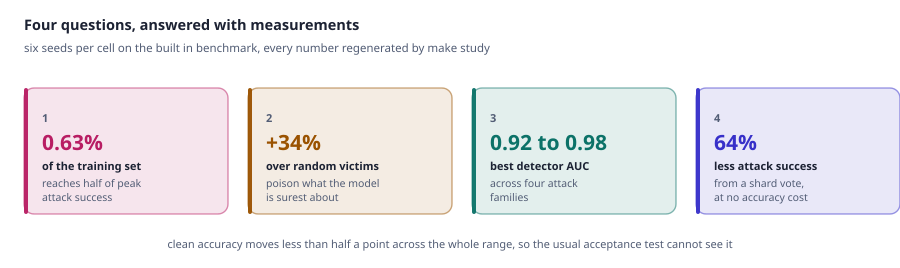
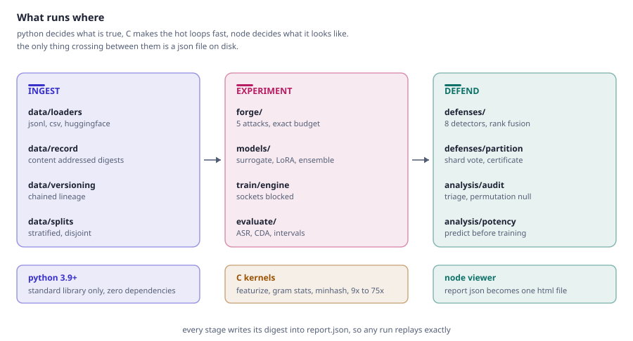
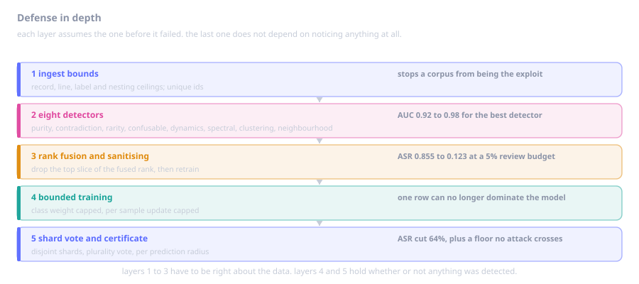
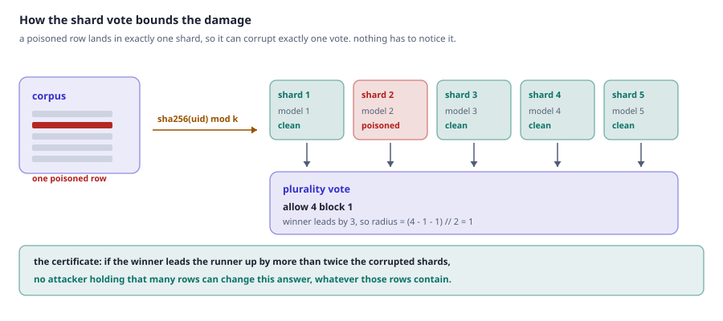
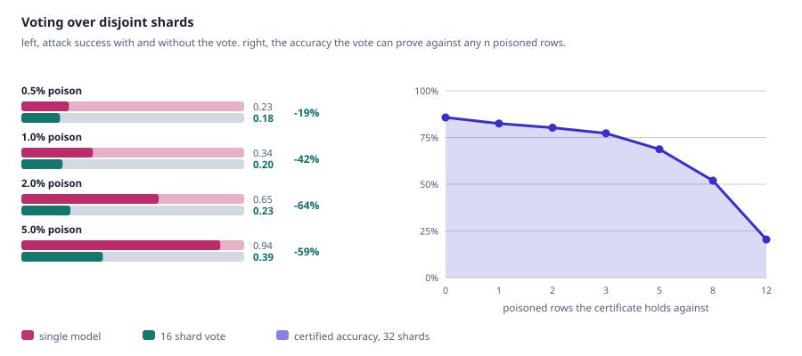
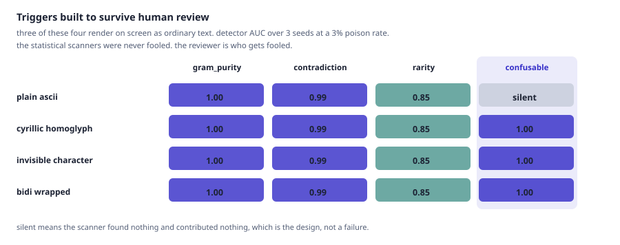
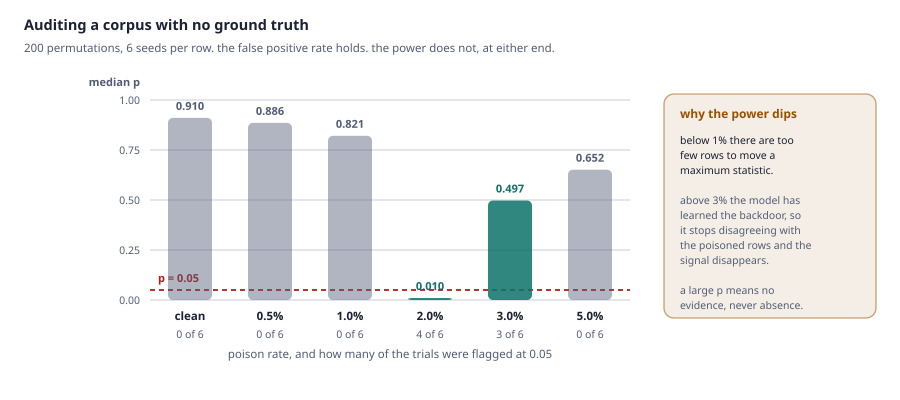
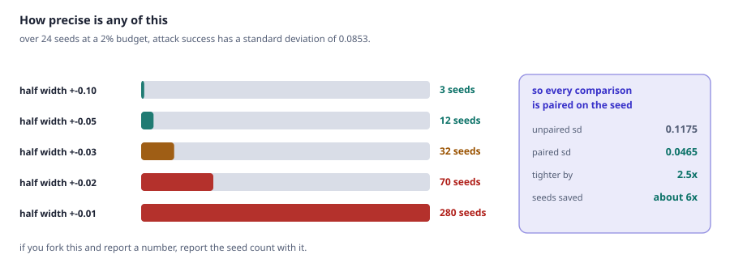
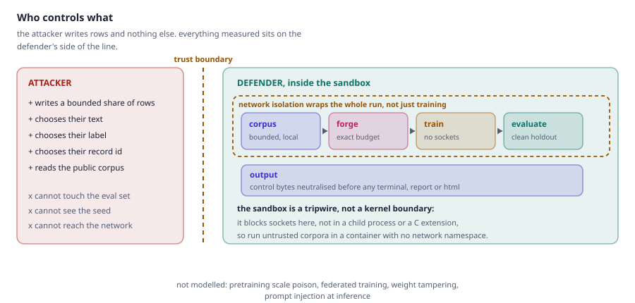
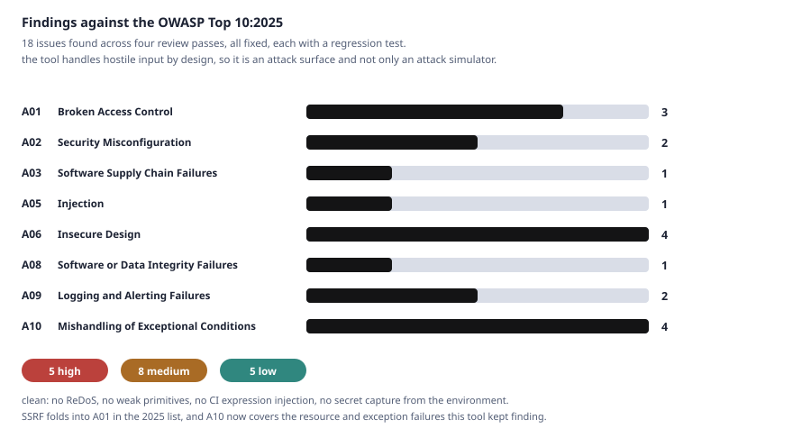

<div align="center">

# PoisonLab

**Poison your own fine-tuning data, measure what the attack actually achieves, and find out whether your review would have caught it.**

[](https://www.python.org/)
[](LICENSE)
[](pyproject.toml)
[](tests/)
[](#security-of-the-tool-itself)

</div>

---

Give it a corpus. It poisons a controlled slice, fine-tunes on the result, measures how much of the
attack landed and what it cost in clean accuracy, then runs eight detectors over the poisoned data
and tells you which ones found it.

Everything runs offline, everything is seeded, and the core imports nothing outside the Python
standard library.

<picture>
  <source media="(prefers-color-scheme: dark)" srcset="docs/assets/pipeline-dark.svg">
  
</picture>

## Four questions, answered with measurements

<picture>
  <source media="(prefers-color-scheme: dark)" srcset="docs/assets/headline-dark.svg">
  
</picture>

Every number here comes from `python scripts/experiments.py`, six seeds per cell. The full study is
[docs/RESULTS.md](docs/RESULTS.md); every chart is generated by `python scripts/figures.py` from the
same JSON that produces those tables, so a chart cannot drift from its number.

---

## The uncomfortable result

<picture>
  <source media="(prefers-color-scheme: dark)" srcset="docs/assets/dose-response-dark.svg">
  
</picture>

At a 2% budget the backdoor fires on **85%** of triggered inputs and held-out accuracy moves less
than half a point. The standard acceptance test for a fine-tune, "did accuracy hold up", cannot see
this attack. The critical rate is **0.63%** of the training set: on 6000 rows, 38 rows.

## The counterintuitive result

<picture>
  <source media="(prefers-color-scheme: dark)" srcset="docs/assets/selection-dark.svg">
  
</picture>

Borrowed from adversarial examples, the obvious guess is that rows near the decision boundary are
cheapest to flip. Over 18 paired trials per strategy it is exactly backwards: poisoning the rows a
probe model is **most certain about** beats random by a third, and boundary rows are a third worse.

A confidently classified counterexample creates a contradiction the model cannot resolve with the
features it already trusts, so the gradient is forced into the one feature the poisoned rows share.
That cuts the defender's way too, and it is what the `contradiction` detector exploits.

## What survives a real review

<picture>
  <source media="(prefers-color-scheme: dark)" srcset="docs/assets/stealth-dark.svg">
  
</picture>

Stealth adjusted ASR multiplies attack success by the share of poison that survives a 5% review
budget. A loud single token trigger has ASR 0.86 and a practical value of **zero**. Spreading the
trigger over several tokens and seeding those tokens into unpoisoned decoy rows keeps ASR 0.90 with
**0.17** surviving review.

---

## Quick start

```bash
git clone https://github.com/fortress07/LLM-Data-Poisoning-Simulation-Sandbox.git poisonlab
cd poisonlab
pip install -e .

poisonlab doctor                        # environment, kernels, isolation self test
poisonlab run configs/backdoor.toml     # one full campaign
poisonlab run configs/certified.toml    # the same attack against a shard vote
```

No dependencies, no downloads, no GPU. Since the core is standard library only, you can also skip
the install entirely with `PYTHONPATH=src python -m poisonlab ...`.

```
campaign      : backdoor-demo          campaign      : certified-demo
attack        : backdoor               attack        : backdoor
poisoned      : 84 records (2.000%)    poisoned      : 84 records (2.000%)
measured ASR  : 0.838                  measured ASR  : 0.256
clean accuracy: 0.8583                 clean accuracy: 0.8650
best detector : gram_purity (1.00)     certified     : 0.8342 against any 1 row
```

Add `--html` for a self-contained dashboard, or `--axis` to `poisonlab sweep` for a whole curve
instead of one point.

---

## How it fits together

<picture>
  <source media="(prefers-color-scheme: dark)" srcset="docs/assets/architecture-dark.svg">
  
</picture>

**Data** is content addressed: the digest hashes each record, sorts the hashes and hashes the list,
so it depends on content and not row order. **Forge** applies one of five attacks to an exact row
count and preserves the original whitespace, so poisoned rows differ only by the trigger. **Train**
blocks outbound sockets for the duration. **Evaluate** reports ASR and accuracy on held-out clean
data with Wilson intervals, next to the counterfactuals that make them meaningful. **Defend** scores,
fuses, sanitises and retrains.

| attack | what it does |
|:--|:--|
| `backdoor` | inserts a trigger and relabels to the attacker's target |
| `composite` | several weak triggers plus decoy rows carrying single triggers |
| `label_flip` | flips labels, no trigger |
| `semantic` | relabels rows containing a natural concept, nothing to grep for |

<picture>
  <source media="(prefers-color-scheme: dark)" srcset="docs/assets/detectors-dark.svg">
  
</picture>

`gram_purity` is perfect on an undiluted trigger and useless everywhere else. `contradiction` is the
only one that holds across all four families. A detector with nothing to say returns constant scores
and is skipped by the fusion, so silence costs the ensemble nothing.

---

## Defense in depth

<picture>
  <source media="(prefers-color-scheme: dark)" srcset="docs/assets/defense-layers-dark.svg">
  
</picture>

Layers 1 to 3 have to be right about the data. Layers 4 and 5 hold whether or not anything was
detected, and that is the part worth explaining.

### Bounding damage instead of detecting it

<picture>
  <source media="(prefers-color-scheme: dark)" srcset="docs/assets/partition-mechanism-dark.svg">
  
</picture>

```toml
[train]
kind = "partition"
shards = 16
```

<picture>
  <source media="(prefers-color-scheme: dark)" srcset="docs/assets/partition-dark.svg">
  
</picture>

The reduction grows as the attack grows, the opposite of how a detector behaves, and it costs nothing
in accuracy. The trade is shard size: a corpus too small to leave roughly fifty rows per shard loses
more than the attacker does.

The vote also carries a proof. **No attacker holding n rows can change a prediction whose vote gap
exceeds 2n**, whatever those rows contain. That is a floor for a small deliberate insertion, not a
score for a vendor shipping 2% poison, and both numbers sit in the same report on purpose.

An adaptive attacker who picks record ids to spread rows across shards gains nothing (ASR 0.243
against 0.266 for natural ids); concentrating them is worse for the attacker at 0.204.

### Triggers built to survive human review

<picture>
  <source media="(prefers-color-scheme: dark)" srcset="docs/assets/evasion-dark.svg">
  
</picture>

The statistical scanners were never fooled, because they count the trigger rather than read it.
**The reviewer is who gets fooled**: a queue entry reading `qz7x` and one hiding a zero width space
are the same picture. So the `confusable` scanner protects the human step, and prints code points:

```
leading carrier: qz<U+200B>7x in 36 documents, 36 of them contradicted  [invisible]
```

---

## Auditing a corpus you did not poison yourself

Everything above needs ground truth. On a corpus somebody sent you, `poisonlab audit` returns a
**review queue** sized to your budget, a **carrier shortlist**, and a **permutation test**, but never
a verdict:

```bash
poisonlab audit --in suspicious.jsonl --budget 0.02 --queue-out review.jsonl
```

<picture>
  <source media="(prefers-color-scheme: dark)" srcset="docs/assets/audit-calibration-dark.svg">
  
</picture>

Read a large p value as no evidence, never as evidence of absence.

## How precise is any of this

<picture>
  <source media="(prefers-color-scheme: dark)" srcset="docs/assets/precision-dark.svg">
  
</picture>

---

## Security of the tool itself

<picture>
  <source media="(prefers-color-scheme: dark)" srcset="docs/assets/threat-model-dark.svg">
  
</picture>

PoisonLab handles hostile input by design: corpora it did not author, reports written elsewhere,
checkpoints from other people, compiled kernels. That makes the tool an attack surface, not just an
attack simulator.

| input | trust | what enforces it |
|:--|:--|:--|
| corpus JSONL and CSV | untrusted | record, line, size, label and nesting ceilings; unique ids; surrogates scrubbed |
| campaign TOML | operator authored | bounded nesting, no code evaluation, validated ranges |
| `report.json` given to `verify` | untrusted | paths confined, isolation forced on, backends, data sources and shard counts bounded |
| model checkpoint JSON | untrusted | label, index and finiteness checks, plus a total allocation ceiling |
| compiled C kernel | untrusted until verified | a private directory this process owns, SHA-256 verified on every load |
| terminal, markdown and HTML output | output | control bytes neutralised, every HTML interpolation escaped, restrictive CSP |

A campaign that declares no network source runs with the isolation guard around **the whole run**,
not just training, so an unexpected socket during ingest or scanning is blocked and recorded rather
than silently allowed.

### Findings against the OWASP Top 10:2025

<picture>
  <source media="(prefers-color-scheme: dark)" srcset="docs/assets/owasp-dark.svg">
  
</picture>

Four review passes, the last one mapped to the 2025 list. Every row has a regression test in
[`tests/test_security_hardening.py`](tests/test_security_hardening.py) or
[`tests/test_owasp.py`](tests/test_owasp.py).

| issue | OWASP:2025 | severity | fix |
|:--|:--|:--|:--|
| `verify` on an untrusted report could fetch an attacker named HuggingFace repo, and ingest ran **outside** the isolation guard | A01 Broken Access Control | high | network sources need an explicit `allow_network`, untrusted replays refuse them, and the guard wraps the whole campaign |
| Loopback allowlist matched by string prefix, so `localhost.attacker.example` escaped the sandbox | A01 Broken Access Control | high | parsed with `ipaddress`, exact hostname set |
| `verify` replayed an untrusted report verbatim, reading any local path and writing anywhere | A01 Broken Access Control | high | every path confined, opting out is explicit |
| Corpus content reached the terminal with raw ANSI bytes, so one planted row could clear the screen and forge a "corpus verified clean" line over the real findings | A05 Injection | high | control bytes neutralised at every output boundary |
| One rare label row could collapse accuracy 19 points, because an unbounded class weight gave it an effective learning rate of 420 against a nominal 0.6 | A06 Insecure Design | high | class weight and per sample update capped, which also improved both recalls |
| Isolation guard leaked its patch under concurrent training, so a run could report enforcement with open sockets | A06 Insecure Design | medium | reference counted process wide registry under a lock |
| Duplicate record ids silently broke budget accounting | A06 Insecure Design | medium | ids unique at ingest, sanitiser removes by position |
| A single non finite detector score reported **average precision 1.0**, making a broken detector look perfect | A06 Insecure Design | medium | non finite scores neutralised, counted and disclosed |
| Native kernel loaded by predictable name from a shared temp directory | A03 Software Supply Chain | medium | private directory, checked before use and never silently repaired, SHA-256 verified |
| A 225 byte checkpoint could drive a 34 GB allocation | A08 Data Integrity | medium | allocation ceiling checked before the array is built |
| An untrusted report could request a 671,000 GB ensemble through the partition backend | A10 Exceptional Conditions | high | shard count and total allocation bounded before any array exists |
| A 1.2 MB JSONL line could crash the process with uncaught deep nesting | A10 Exceptional Conditions | medium | refused with a clear error |
| JSONL loader had no record, line or label ceilings, and the label count fed an O(n squared) matrix | A10 Exceptional Conditions | medium | explicit limits, raisable by the operator |
| An empty evaluation set reported clean accuracy 0.0, reading as total failure rather than no data | A10 Exceptional Conditions | low | unmeasured metrics report null with an explicit flag |
| CI workflow had no `permissions:` block, inheriting the default token scope | A02 Security Misconfiguration | medium | pinned to `contents: read` |
| Dataset index written in place, so a crash lost every version | A02 Security Misconfiguration | low | atomic write, commits serialised |
| Operator secrets placed in a config were echoed verbatim into shareable reports | A09 Logging and Alerting | low | secret shaped keys redacted, key names kept visible |
| Isolation report hardcoded `enforced: true`; no CSP on the rendered page; `trust_remote_code` unpinned | A09 Logging and Alerting | low | probe backed, CSP added, pinned off |

Clean on the rest of the sweep: no ReDoS (nine regexes, worst case 0.8 ms on 200k character
adversarial input), no weak primitives, no expression injection in CI, no privileged workflow
trigger, no secret capture from the environment, and zero third party dependencies in the core.

### What the sandbox does and does not cover

The guard patches `connect`, `connect_ex`, `sendto`, `create_connection`, `getaddrinfo`,
`gethostbyname` and `gethostbyname_ex`, sets the offline environment variables, and verifies the
block with a live probe before training. It is process wide and reference counted, so concurrent and
nested runs compose and a permissive guard cannot relax a strict one.

It does not cover a child process, a raw file descriptor, or a C extension that bypasses the Python
socket module. For untrusted corpora at scale, run PoisonLab in a container with no network
namespace. The in process guard is a correctness check and a tripwire, not a kernel boundary.

Found something? Open a private security advisory rather than a public issue. The attack modules
producing effective poison is the purpose of the project and is not a vulnerability; anything that
turns an input into code execution, an out of bounds file access, or a silent sandbox escape is.

---

## Reproducibility

One master seed feeds a SHA-256 derivation that hands every stage an independent stream, so changing
the training seed cannot shift the corpus. Reports embed the config, the environment fingerprint and
every dataset digest.

```bash
poisonlab verify runs/backdoor-demo-20260825-085249
```

```
poisoned dataset digest  ok  expected=196ef6b3... actual=196ef6b3...
attack success rate      ok  expected=0.837638 actual=0.837638
reproducible: True
```

Regenerate everything on this page:

```bash
make study            # rewrites docs/RESULTS.md
make figures          # rewrites docs/assets/*.svg in both themes, then checks their layout
```

## Tests

```bash
make test                        # 522 python tests, about 30 seconds
make test-node                   # 17 viewer tests
POISONLAB_ACCEL=off make test    # the same suite without the C kernels
```

The suite targets what would quietly invalidate a result rather than crash: exact poison budgets,
byte identical output between the C and Python kernels on fuzzed Unicode, deterministic digests,
**detectors never reading `record.origin`** (checked by permuting the ground truth and asserting the
scores do not move), metric arithmetic against hand computed values, Wilson coverage by simulation,
permutation test calibration under the null, the certificate checked against its own definition and
against an adaptive attacker, and a full campaign replaying to the same digests twice.

## Documentation

| | |
|:--|:--|
| [docs/RESULTS.md](docs/RESULTS.md) | every measurement, regenerated by `make study` |
| [docs/ARCHITECTURE.md](docs/ARCHITECTURE.md) | how the pieces fit and why |
| [docs/METRICS.md](docs/METRICS.md) | what each number means, what it does not, and how precise it is |
| [docs/THREAT_MODEL.md](docs/THREAT_MODEL.md) | what is modelled, and the tool's own trust boundaries |
| [docs/EXTENDING.md](docs/EXTENDING.md) | adding an attack, a detector, a backend or a kernel |

## Responsible use

A defensive research tool. The attacks exist so detection and mitigation can be measured against
something real, on data you own. The synthetic corpus is the default precisely so the whole study
reproduces without touching anybody else's data.

Every poisoned record is marked with `origin = "poisoned"` and the attack that touched it. Please
leave that marker in place on anything you publish; it is what lets a downstream user tell a
benchmark apart from a real corpus.

## License

MIT. See [LICENSE](LICENSE).
